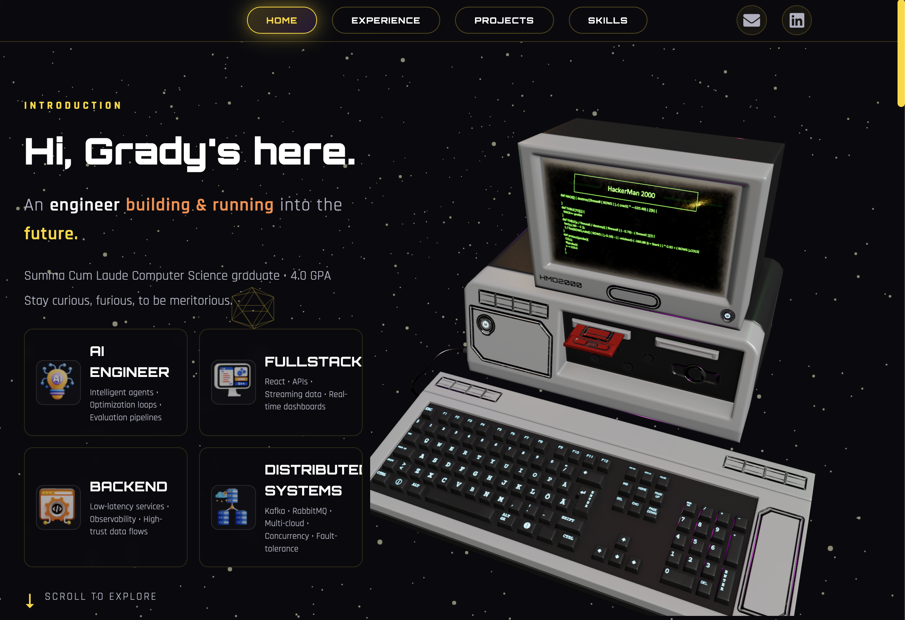

  
# 👋 Hi, I'm Giang (Grady) Ta

### 🚀 Software Engineer | AI/ML Enthusiast

  <a href="https://gradyta.netlify.app" target="_blank" style="text-decoration: none;">
    
     
    
  </a>

     

---

## 🎓 Education

**San Jose State University** | *B.S. Computer Science* | **4.0 GPA** - *Summa Cum Laude*  

---

## 💼 Highlights of Professional Experience

### 🏢 **Centric Software** *(Dassault Systèmes)*
**Software Engineer** | May 2024 - Present | San Jose, CA

- 🎯 Built **AI-powered PLM platform** serving **800+ global enterprise clients** (LVMH, Hermès, Balenciaga, Uniqlo, Starbucks, Under Armour)
- ⚡ Optimized query response times by **7x-20x**, supporting **5,000+ concurrent users**
- 🚀 Developed lightweight archiving pipeline — **60% faster** queries and reduced storage
- 🧵 Built **multi-threaded query acceleration** — **60% speed improvement**
- 📊 Optimized recursive lookups with precomputed filters — **90% faster**
- 🔧 Technologies: Java, Python, JavaScript, React.js, Spring Boot, Kafka, SQL Server, Jenkins, Docker

### 🔮 **Presight.IO**
**Software Engineer Intern** | Jun 2023 - Sept 2023 | Seattle, WA

- 📈 Designed **multi-agents econometric simulations** for **80+ e-commerce stores**
- 🎯 Achieved **70% predictive accuracy** modeling financial dynamics
- 🔧 Technologies: Python, PyMC, PyTensor, NumPy, SQL Server, Machine Learning

---

## 🛠️ Tech Stack

### 💻 Languages

### 🎨 Frontend

### ⚙️ Backend & Frameworks

### 🗄️ Databases

### 🚀 DevOps & Cloud

### 🔄 Message Queues & Streaming

### 🤖 AI/ML & Data Science

### 🎮 Game Development

---

## 🌟 Featured Projects

### 🤖 [Autonomous Traders Lab](https://github.com/ggmaddr/Autonomous-Traders-Lab)

**Multi-agent AI trading system** with 8 collaborative AI agents  
✅ **37% better** decision quality | **55% cost reduction** | **4× faster** execution (0.6s) | **99.9% uptime**

---

### ♻️ [AI Trash Sorting](https://github.com/realdarter/Trash-Classification)

**ML-powered waste classification** using CNN-based ResNet-50  
✅ **98% accuracy** | 5+ waste types | Flask backend | Kaggle dataset integration

---

### 💬 [Cipher Chat](https://github.com/ggmaddr/CipherChat)

**Real-time messaging app** with ChatGPT-4.0 bot integration  
✅ WebSocket | Prisma | GraphQL API | 3D UI with Three.js

---

### 🧩 [Automatic A* Puzzle Solver](https://github.com/ggmaddr/AI-Computer-Vision-Water-Puzzle-Solver-)

**Robotic puzzle solver** with computer vision & A* pathfinding  
✅ **2 second** max solve time | **70% search space reduction** | 100% accuracy

---

### 💰 [Real-Time Crypto Tracker](https://github.com/ggmaddr/crypto-real-time)

**Full-stack cryptocurrency tracking** platform  
✅ CoinGecko API integration | Real-time data | MySQL backend

---

### 🎮 [3D FPS Shooting Legends](https://github.com/ggmaddr/3D-FPS-Shooting-Legends/tree/main)

**3D FPS game** with AI-controlled enemies  
✅ Unreal Engine 5 | Dynamic particle effects | Autonomous AI

